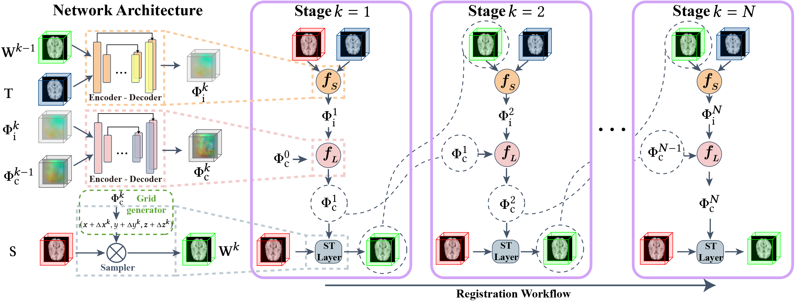

# ABN

Anonymous repository for Anti-Blur Neural Networks for Multi-Stage Deformable Image Registration (ABN). This repository contains the implementation of ABN.



## File listing

The corresponding folder contains the source code for 2D and 3D image registration.

+ __2D__ : 2D image registration task
    + __dataset__ : Sample dataset for 2D image registration
    + __main.py__ : Main code for ABN training
    + __model.py__ : Supporting models
    + __train.py__ : Supporting training
    + __utils.py__ : Supporting functions


+ __3D__ : 3D image registration task
    + __dataset__ : Sample dataset for 3D image registration
    + __main.py__ : Main code for ABN training
    + __model.py__ : Supporting models
    + __preprocess_data.py__ : Using for preprocess data
    + __train.py__ : Supporting training
    + __utils.py__ : Supporting functions

Note that all public datasets used in the paper can be found here:
+ __[FFHQ](https://github.com/NVlabs/ffhq-dataset)__ : for 2D face image.
+ __[LPBA40](https://resource.loni.usc.edu/resources/atlases-downloads/)__ : for 3D brain MRI.
+ __[Mindboggle101](https://mindboggle.info/data.html)__ : for 3D brain MRI.

## Instructions on training ABN

The following script is for training:

```
python main.py
```
<b>Parameters:</b>
+ __2D__ :
    + __img_size__ : size of input image, default 64
    + __num_stage__ : number of stages of ABN, default 10
    + __train_set_name__ : file name of training dataset, default 2D_face_train.npy
    + __test_set_name__ : file name of test dataset, default 2D_face_test.npy
    + __batch_size__ : batch size, default 16
    + __num_epochs__ : number of epochs, default 5000
    + __model_name__ : model, default ABN_2D
    + __loss_name__ : loss function, default MSE
    + __smooth_name__ : regularization, default second_Grad
    + __learning_rate__ : learning rate, default 0.0001
    + __lamda__ : lamda of regularization, default 10
    + __penalty__ : penalty of regularization, default l2
    + __save_every_epoch__ : gap of saving model, default 20
    + __num_sample__ : number of images displayed, default l6
    + __num_lines__ : number of grid lines displayed in the warped image, default 15
    + __grid_sample_orig__ : warping image from the original source image, default True   
    

+ __3D__ :
    + __img_size__ : size of input image, default 96
    + __num_stage__ : number of stages of ABN, default 10
    + __train_set_name__ : file name of training dataset, default LPBA40_train_sub.npy
    + __test_set_name__ : file name of test dataset, default LPBA40_test_sub.npy
    + __batch_size__ : batch size, default 1
    + __num_epochs__ : number of epochs, default 1000
    + __model_name__ : model, default ABN_3D
    + __loss_name__ : loss function, default NCC
    + __smooth_name__ : regularization, default second_Grad
    + __learning_rate__ : learning rate, default 0.0001
    + __lamda__ : lamda of regularization, default 10
    + __penalty__ : penalty of regularization, default l2
    + __save_every_epoch__ : gap of saving model, default 10
    + __sample_orig,__ : warping image from the original source image, default True

## Result
The results can be find after training.
+ __loss_log__ :
    + __model_name.txt__ : log file of the model
+ __model__ :
    + __model_name.pth__ : saved model
+ __sample_img__ :
    + __o__ : target images
    + __t__ : source images
    + __p_stage__ : warped images by stage
    + __p_stage_grid__ : warped images by stage with grid displayed